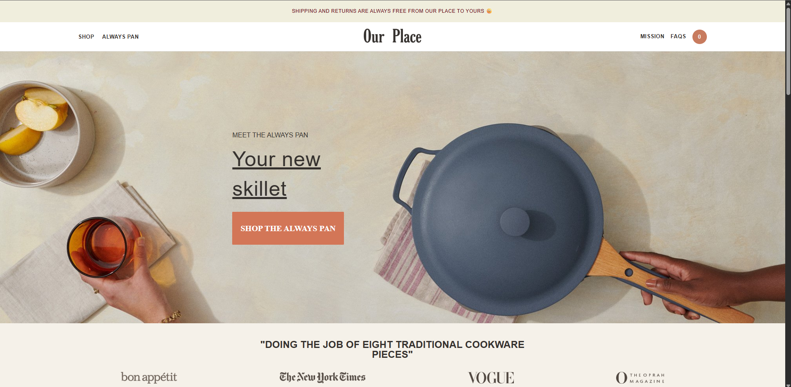
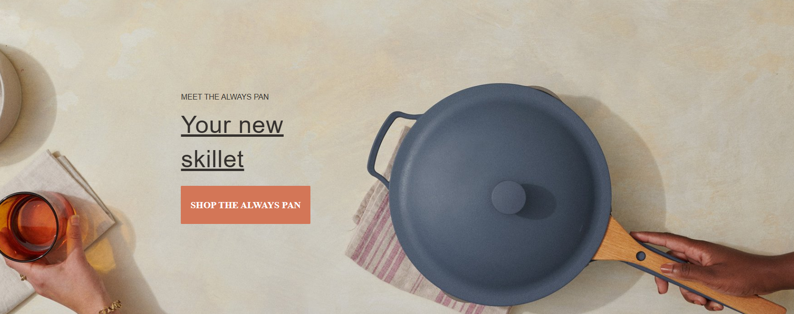
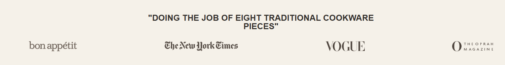
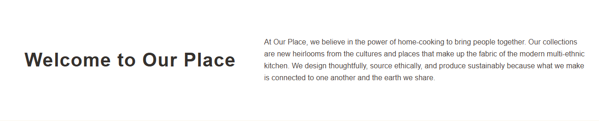
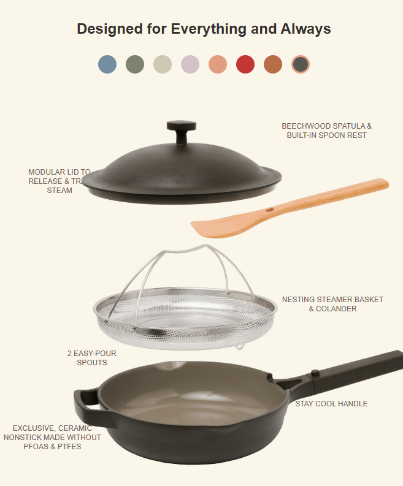
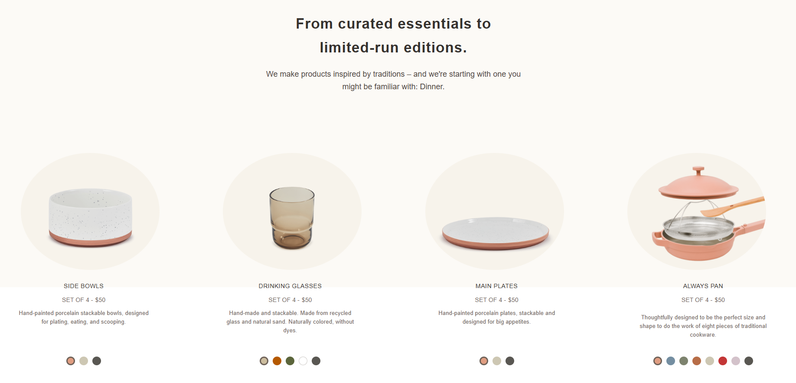
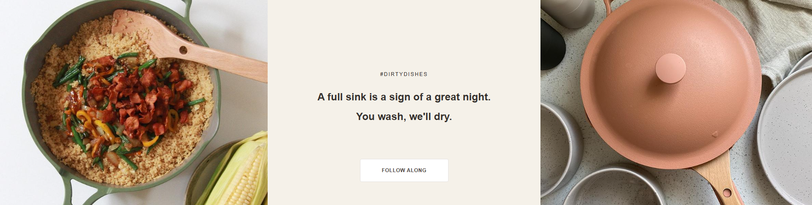
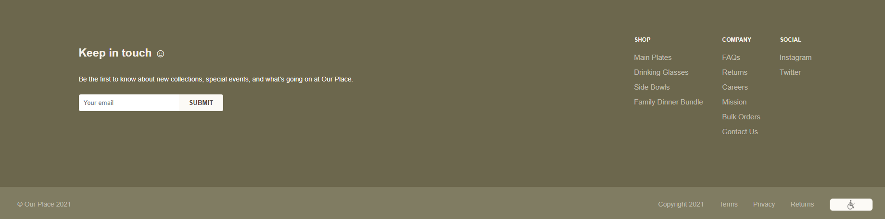

# 🍳 Skillet Shop - Cookware E-commerce Website



A modern, elegant e-commerce website for premium cookware products. Designed with a focus on user experience and visual appeal.

## 📋 Table of Contents
- [Live Demo](#-live-demo)
- [Project Overview](#-project-overview)
- [Detailed Block Breakdown](#-detailed-block-breakdown)
- [Features](#-features)
- [Technologies Used](#-technologies-used)
- [Project Structure](#-project-structure)
- [Installation](#-installation)
- [Design Elements](#-design-elements)
- [Contributing](#-contributing)
- [License](#-license)

## 🌐 Live Demo
[View Live Website](#) | [GitHub Repository](https://github.com/your-username/skillet-shop)

## 🎯 Project Overview
Skillet Shop is a premium e-commerce platform showcasing high-quality cookware. The website features a clean, minimalist design with focus on product presentation and user experience.

## 🏗️ Detailed Block Breakdown

### 1. **Header & Navigation Bar** 🏷️

- **Fixed top navigation** with logo centered
- **Left menu**: Shop, Always Pan
- **Right menu**: Mission, FAQs, Cart button
- **Top bar** for promotional messages
- **Smooth hover effects** on navigation links

### 2. **Hero Section** 🎬

- **Full-width background image** with overlay
- **Prominent headline**: "Your new skillet"
- **Clear call-to-action button**
- **Subtle text animations** and underline effects
- **Responsive text sizing** for different screens

### 3. **Features Showcase** ⭐

- **Testimonial quote** from press/media
- **Four feature icons** displayed horizontally
- **Clean background** with light beige color
- **Centered alignment** for balanced layout
- **Icon hover effects** for interactivity

### 4. **About Us Section** 📖

- **Two-column layout** (title + description)
- **Brand story presentation**
- **Modern typography** with generous spacing
- **Responsive flexbox** for mobile adaptation
- **Subtle background** for content separation

### 5. **Product Detail - Skillet** 🔧

- **Interactive color palette** (8 colors)
- **Detailed product specifications**
- **Annotated image** with callout labels
- **Technical features** explained visually
- **Callout lines** pointing to specific features

### 6. **Collection Showcase** 🛍️

- **Four product categories** displayed
- **Circular image containers** for visual appeal
- **Product titles** and descriptions
- **Responsive grid layout**
- **Consistent spacing** between items

### 7. **Product Grid** 📦

- **Four-column product display**
- **Individual product cards** with:
  - Product name and title
  - Pricing information
  - Description text
  - Color selection options
- **Interactive color dots** for selection
- **Consistent card heights** for alignment

### 8. **Social Proof Section** 📸

- **Split background design** with side images
- **Hashtag promotion**: #DirtyDishes
- **Engaging headline** about community
- **Call-to-action button** centered
- **Brand personality** display

### 9. **Footer Section** 👣

- **Newsletter subscription** form
- **Three-column link organization** (Shop, Company, Social)
- **Company information** and copyright
- **Terms and privacy** links
- **Brand logo/icon** placement

## ✨ Features

- **Modern Design** - Clean, minimalist aesthetic with premium feel
- **Product Showcase** - Beautiful presentation of cookware collections
- **Color Selection** - Interactive color palette display
- **Responsive Layout** - Optimized for desktop viewing
- **Product Collections** - Organized display of cookware sets
- **Interactive Elements** - Hover effects and visual feedback
- **Clear Navigation** - Intuitive site structure
- **Brand Storytelling** - Effective communication of brand values

## 🛠️ Technologies Used

- **HTML5** - Semantic markup with modern elements
- **CSS3** - Advanced styling with variables and flexbox
- **Google Fonts** - Roboto font family integration
- **Flexbox Layout** - Modern responsive design approach
- **CSS Positioning** - Absolute positioning for precise elements
- **Media Queries** - Responsive design adjustments
- **CSS Variables** - Consistent color theming

## 📁 Project Structure

skillet-shop/
├── index.html # Main HTML file
├── style.css # Stylesheet (1,200+ lines)
├── README.md # Project documentation
├── .gitignore # Git ignore rules
├── assets/
│ ├── images/
│ │ ├── logo.png
│ │ ├── image.jpg
│ │ ├── skillet.png
│ │ ├── your-image.png
│ │ ├── left.jpg
│ │ ├── right.jpg
│ │ ├── icon1.png
│ │ ├── icon2.png
│ │ ├── icon3.png
│ │ ├── icon4.png
│ │ ├── bowls.png
│ │ ├── glasses.png
│ │ ├── plates.png
│ │ ├── pan.png
│ │ ├── icon.png
│ │ ├── header-preview.png
│ │ ├── hero-preview.png
│ │ ├── nav-preview.png
│ │ ├── features-preview.png
│ │ ├── about-preview.png
│ │ ├── skillet-preview.png
│ │ ├── collections-preview.png
│ │ ├── products-preview.png
│ │ ├── social-preview.png
│ │ └── footer-preview.png
│ └── fonts/
│ └── roboto/ # Optional local fonts

text

## 🚀 Installation & Setup

### Quick Start
1. **Clone the repository:**
   ```bash
   git clone https://github.com/your-username/skillet-shop.git
Navigate to the project:

bash
cd skillet-shop
Open in browser:

Open index.html directly in your browser

Or use a local development server

Development Server Options
bash
# Using Python (Simple)
python -m http.server 8000

# Using Node.js with http-server
npx http-server

# Using PHP
php -S localhost:8000
🎨 Design Elements
Color Palette
Primary Text: #35312E (Dark Gray)

Primary Accent: #D37657 (Coral Orange)

Secondary Accent: #C87B5E (Burnt Orange)

Background Light: #F5F1E9 (Light Beige)

Background White: #FCFAF6 (Off-White)

Highlight Color: #E09D81 (Salmon Pink)

Promotional Background: #F0EEDD (Cream)

Footer Dark: #6C674D (Olive Green)

Typography
Font Family: Roboto (Google Fonts)

Weights Used: 400 (Regular), 700 (Bold), 900 (Black)

Line Heights: 1.6 for body, 1.2-1.4 for headings

Letter Spacing: 0.5px - 1.25px for headings

Spacing System
Base Unit: 8px

Small Padding: 5-10px

Medium Padding: 20-40px

Large Padding: 60-90px

Gap Sizes: 15px, 30px, 40px

🖥️ Browser Support
✅ Chrome 90+

✅ Firefox 88+

✅ Safari 14+

✅ Edge 90+

⚠️ Note: Primarily optimized for desktop viewing

📱 Responsive Note
This website is primarily optimized for desktop viewing. While it includes basic mobile adjustments, the main design targets desktop users for the best shopping experience.

🛒 Product Sections
Hero Banner - Main product showcase with CTA

Features - Key selling points and press mentions

About Us - Brand story and values

Product Details - Skillet specifications and features

Collections - Product categories display

Product Grid - Item display with color options

Social Proof - Community engagement section

Footer - Newsletter, links, and legal information

🎯 Key Components
Navigation Bar - Fixed header with logo, menu, and cart

Product Cards - Individual product displays with color variants

Color Selector - Interactive color palette with active states

Call-to-Action Buttons - Prominent purchase prompts

Newsletter Form - Email subscription with validation

Footer Navigation - Comprehensive site links

Annotated Images - Product feature callouts

Testimonial Display - Press quotes and reviews

📸 Image Assets Required
Place the following images in assets/images/:

File	Purpose	Recommended Size
logo.png	Website logo	150×50px
image.jpg	Hero background	1920×800px
skillet.png	Main product image	600×600px
your-image.png	Secondary product image	1200×400px
left.jpg, right.jpg	Background side images	640×480px each
icon1-4.png	Feature icons	60×60px each
bowls.png, glasses.png, plates.png, pan.png	Product images	300×300px each
icon.png	Footer icon	90×30px
🤝 Contributing
Contributions are welcome! Please feel free to submit a Pull Request.

Fork the project

Create your feature branch (git checkout -b feature/AmazingFeature)

Commit your changes (git commit -m 'Add some AmazingFeature')

Push to the branch (git push origin feature/AmazingFeature)

Open a Pull Request

Development Guidelines
Follow existing code style and structure

Test changes on multiple screen sizes

Update documentation if needed

Use semantic HTML elements

Maintain color consistency

📄 License
This project is licensed under the MIT License - see the LICENSE file for details.

🙏 Acknowledgments
Design inspiration from modern e-commerce platforms

Roboto font by Christian Robertson (Google Fonts)

Product photography concepts from premium brands

UI/UX patterns from leading online retailers
